

教育背景
------
* <strong>哈尔滨工业大学-南方科技大学</strong> (2021-2025)
  * 联合培养 博士
  * 导师：[何志海](https://www.sustech.edu.cn/zh/faculties/zhihaihe.html) (IEEE Fellow) 
  * 专业: 电子信息
* <strong>德克萨斯大学</strong> (2015-2016)
  * 硕士: 信息系统
* <strong>东北大学</strong> (2009-2015)
  * 本科：软件工程

科研经历
------
* <strong>深圳大学计算机与软件学院 </strong> (07/2025 - 至今)
  *  助理教授
* <strong>剑桥大学应用数学与理论物理系 </strong> (03/2024 - 09/2024)
  *  访问学者
* <strong>南方科技大学AI Lab  </strong> (03/2021 - 09/2021)
  *  研究助理

业界经历
------
* <strong>华为，SAP </strong> (07/2018- 07/2020)
  * 软件工程师

研究兴趣
------
我的研究兴趣位于<strong>多模态学习、基础模型、人本智能以及面向智能系统的软件工程</strong>的交叉方向。总体而言，我关注如何构建能够<strong>高效适配、稳健泛化、可信可控、与人自然协作，并能够在真实环境中被可靠构建、部署与维护</strong>的智能系统。

过去几年，我主要研究<strong>视觉语言模型的适配、参数高效微调与泛化</strong>，重点关注基础模型在新任务、新领域和分布变化条件下，如何以更低成本实现高效迁移与稳健泛化。在这一过程中，我尤其关注结合几何、优化与结构化建模等数学工具，探索更具原理性和可解释性的多模态学习方法。

近期，我也开始关注<strong>大模型的可信性与可控性</strong>，包括 <strong>Machine Unlearning</strong> 和 <strong>Watermarking &amp; Fingerprinting</strong> 等问题，希望推动大模型在真实应用中的安全部署、内容溯源与可靠使用。

面向未来，我尤其对<strong>第一人称视觉、第一人称智能体以及第一人称多模态大模型</strong>感兴趣。我的长远目标是构建 <strong>Human-AI Co-Embodied Intelligence</strong>，使人工智能能够从第一人称视角理解人的行为、意图与环境交互，并在人机共处的真实世界中与人共同感知、共同理解、共同演化。

更广义地说，我的软件工程背景也促使我持续思考：如何将基础模型、多模态智能与具身智能的研究进展，进一步转化为可构建、可评测、可部署、可维护的真实智能系统。

* <strong>多模态基础模型的高效适配与泛化</strong>：研究视觉语言模型与多模态基础模型的高效适配、参数高效微调与稳健泛化，包括 LoRA、Adapters、Prompt Learning 等参数高效方法。
* <strong>大模型的可信与可控机制</strong>：研究 Machine Unlearning、Watermarking & Fingerprinting 等方向，提升大模型在真实应用中的可控性、可追踪性与可靠性。
* <strong>第一人称多模态智能与人机共具身智能</strong>：研究第一人称视觉、第一人称智能体和第一人称多模态大模型，探索以人为中心的感知、推理与协作机制，推动 Human-AI Co-Embodied Intelligence。
* <strong>面向多模态与具身智能系统的软件工程</strong>：研究如何将多模态基础模型与具身智能能力系统化地组织为可构建、可测试、可部署、可维护的真实系统，重点关注模块化架构、可靠性评测、人机闭环交互与生命周期管理。

学术任职
------
* 期刊审稿人：TMM, Neurocomputing
* 会议审稿人：CVPR, ICLR, NeurIPS, AAAI, ECCV，ACL

学术活动
------

<!--
奖项荣誉
------
* 第二届EgoVis（第一人称视角）Ego-Exo4D Correspondence挑战赛第二名 @CVPRW25（2025）

-->

发表作品
------
<table style="width:100%">
  <tr>
    <th width="30%">
      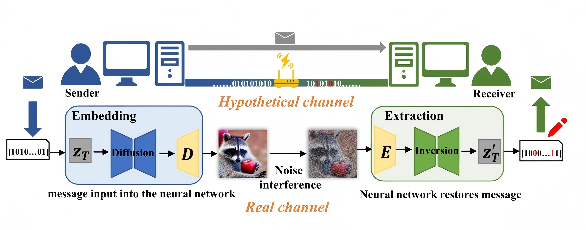
    </th>
    <th style="text-align:left" width="70%">
            Gaussian Shannon: High-Precision Diffusion Model Watermarking Based on Communication 
             
             <strong>Yi Zhang</strong>, Hongbo Huang, Liang-Jie Zhang
             
             The IEEE/CVF Conference on Computer Vision and Pattern Recognition (<strong>CVPR2026 </strong>).<strong>CCF-A</strong>  
            [<a href="https://arxiv.org/pdf/2603.26167">论文</a>][<a href="https://github.com/Rambo-Yi/Gaussian-Shannon">代码</a>][<a href="">项目网页 </a>]
    </th>
  </tr> 
</table>

<table style="width:100%">
  <tr>
    <th width="30%">
      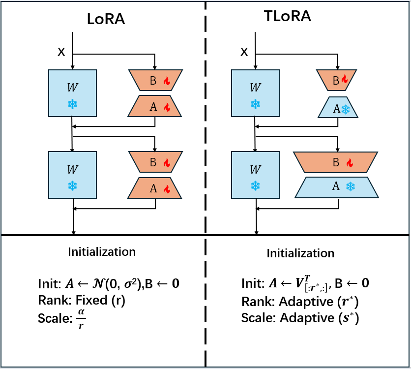
    </th>
    <th style="text-align:left" width="70%">
            TLoRA: Task-aware Low Rank Adaptation of Large Language Models 
             
            Weicheng Lin* <strong>Yi Zhang*(Co-first Author)</strong>, Jiawei Dang, Liang-Jie Zhang
             
              The 64th Annual Meeting of the Association for Computational Linguistics (<strong>ACL2026 </strong>).<strong>CCF-A</strong>  
            [<a href="https://arxiv.org/abs/2604.18124">论文</a>][<a href="https://
github.com/Rambo-Yi/TLora/tree/main">代码</a>][<a href="">项目网页 </a>]
    </th>
  </tr> 
</table>

<table style="width:100%">
  <tr>
    <th width="30%">
      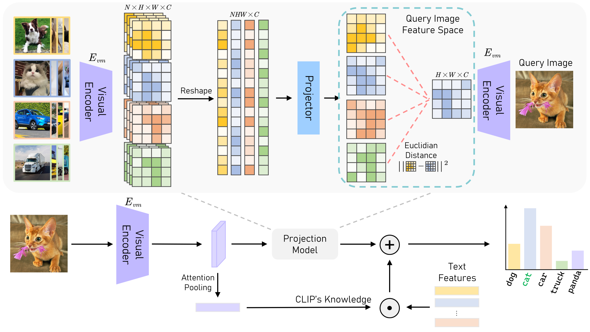
    </th>
    <th style="text-align:left" width="70%">
            Feature Projection Learning for Better Vision-Language Reasoning
             
           <strong>Yi Zhang</strong> , Weicheng Lin, Liang-Jie Zhang
             
            2026 IEEE International Conference on Acoustics, Speech, and Signal Processing (<strong>ICASSP2026</strong>) <strong>CCF-B</strong>  
            [<a href="https://arxiv.org/pdf/2601.20224">论文</a>]
    </th>
  </tr> 
</table>

<table style="width:100%">
  <tr>
    <th width="30%">
      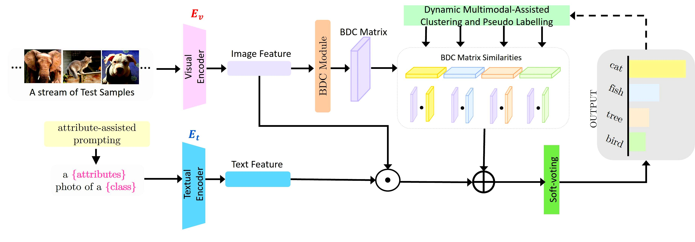
    </th>
    <th style="text-align:left" width="70%">
            Training-Free Test-Time Adaptation with Brownian Distance Covariance in Vision-Language Models
             
           <strong>Yi Zhang</strong> , Chun-Wun Cheng, Angelica I Aviles-Rivero, Zhihai He, Liang-Jie Zhang
             
            2026 IEEE International Conference on Acoustics, Speech, and Signal Processing (<strong>ICASSP2026</strong>) <strong>CCF-B</strong>  
            [<a href="https://arxiv.org/pdf/2601.23253">论文</a>]
    </th>
  </tr> 
</table>

<table style="width:100%">
  <tr>
    <th width="30%">
      
    </th>
    <th style="text-align:left" width="70%">
            Training-Free Dual Hyperbolic Adapters for Better Cross-Modal Reasoning 
             
            <strong>Yi Zhang</strong>, Chun-Wun Cheng, Junyi He, Ke Yu, Yushun Tang, Carola-Bibiane Schönlieb, Angelica I Aviles-Rivero
             
             IEEE Transactions on Mutltimedia(<strong>TMM</strong>).<strong>CCF-A SCI中科院一区</strong> 
            [<a href="https://arxiv.org/pdf/2512.08820">论文</a>]
    </th>
  </tr> 
</table>

<table style="width:100%">
  <tr>
    <th width="30%">
      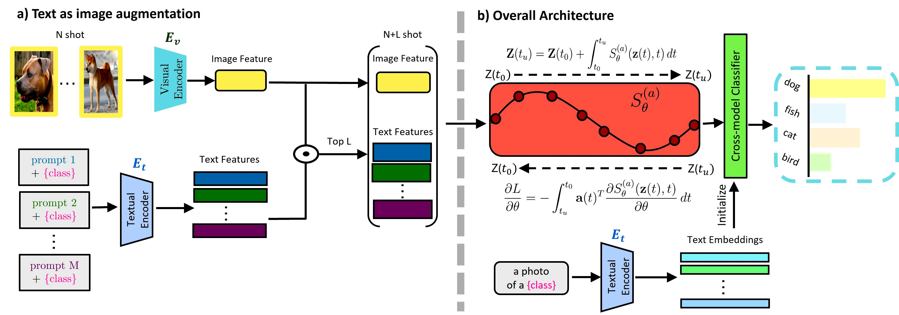
    </th>
    <th style="text-align:left" width="70%">
            Cross-Modal Few-Shot Learning with Second-Order Neural Ordinary Differential Equations 
             
            <strong>Yi Zhang</strong>, Chun-Wun Cheng, Junyi He, Zhihai He, Carola-Bibiane Schönlieb, Yuyan Chen, Angelica I Aviles-Rivero
             
              AAAI Conference on Artificial Intelligence (<strong>AAAI2025</strong>). Oral Paper, 接收率=4.6\%, <strong>CCF-A</strong>  
            [<a href="https://arxiv.org/pdf/2412.15813">论文</a>][<a href="">Code</a>][<a href="">Project Page </a>]
    </th>
  </tr> 
</table>

<table style="width:100%">
  <tr>
    <th width="30%">
      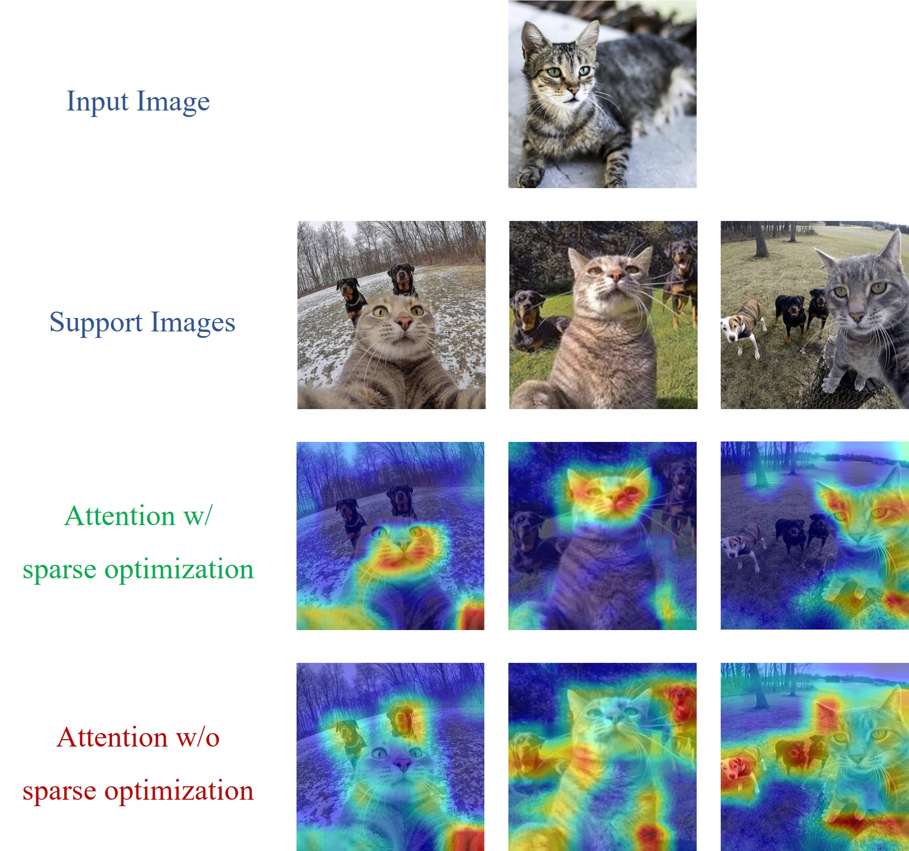
    </th>
    <th style="text-align:left" width="70%">
            Training-Free Feature Reconstruction with Sparse Optimization for Vision-Language Models
             
              <strong>Yi Zhang</strong>, Ke Yu, Angelica I Aviles-Rivero, Jiyuan Jia, Yushun Tang, Zhihai He
             
              ACM International Conference on Multimedia (<stonrg>ACMMM2024</stonrg>) <strong>CCF-A</strong>  
            [<a href="https://openreview.net/pdf?id=bXhz5c12Ee">论文</a>]
    </th>
  </tr> 
</table>

<table style="width:100%">
  <tr>
    <th width="30%">
      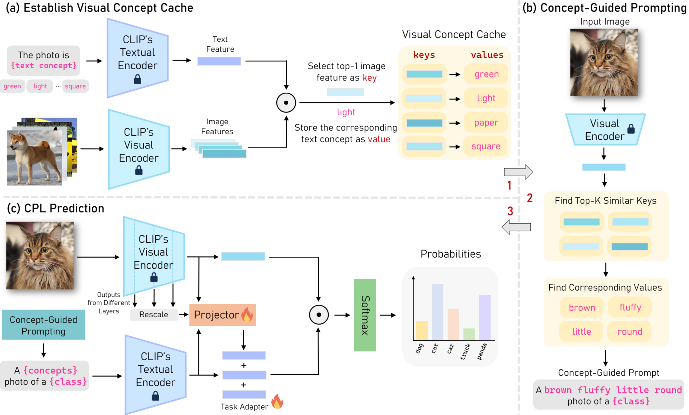
    </th>
    <th style="text-align:left" width="70%">
            Concept-Guided Prompt Learning for Generalization in Vision-Language Models 
             
            <strong>Yi Zhang</strong>, Ce Zhang, Ke Yu, Yushun Tang, and Zhihai He
             
              The AAAI Conference on Artificial Intelligence<strong>(AAAI2024), CCF-A</strong>  
            [<a href="https://arxiv.org/pdf/2401.07457.pdf">论文</a>]
    </th>
  </tr> 
</table>

<table style="width:100%">
  <tr>
    <th width="30%">
      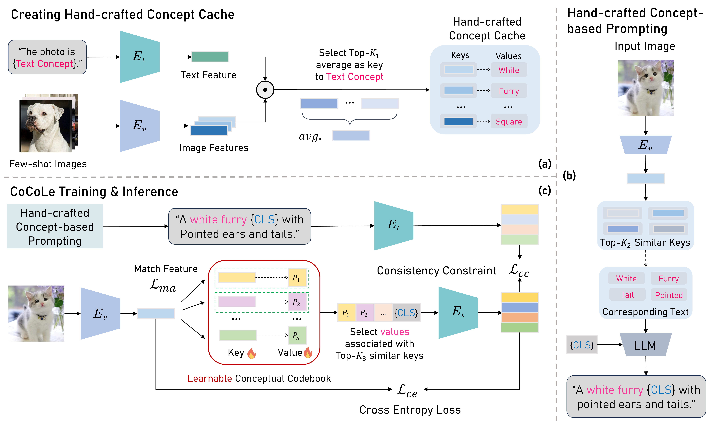
    </th>
    <th style="text-align:left" width="70%">
            Conceptual Codebook Learning for Vision-Language Models
             
           <strong>Yi Zhang</strong> , Ke Yu, Siqi Wu and Zhihai He
             
            European Conference on Computer Vision (<strong>ECCV2024</strong>) <strong>CCF-B</strong>  
            [<a href="https://arxiv.org/pdf/2407.02350">论文</a>]
    </th>
  </tr> 
</table>

<table style="width:100%">
  <tr>
    <th width="30%">
      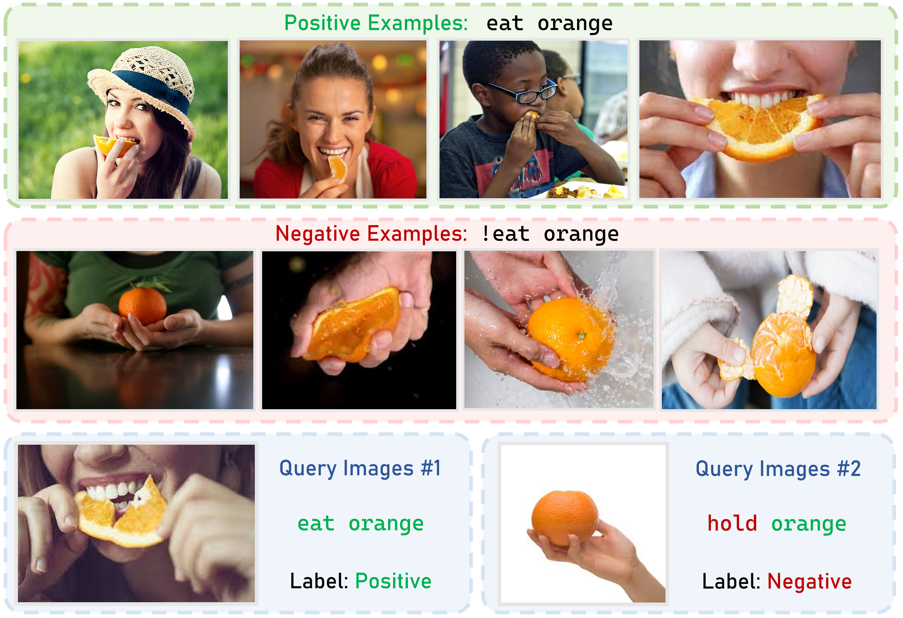
    </th>
    <th style="text-align:left" width="70%">
            Test-time Distribution Learning Adapter for Cross-Modal Visual Reasoning
             
           <strong>Yi Zhang</strong> ,  Ce Zhang
             
            2024 IEEE International Conference on Acoustics, Speech, and Signal Processing (<strong>ICASSP2024</strong>) <strong>CCF-B</strong>  
            [<a href="https://arxiv.org/pdf/2403.06059">论文</a>]
    </th>
  </tr> 
</table>

<table style="width:100%">
  <tr>
    <th width="30%">
      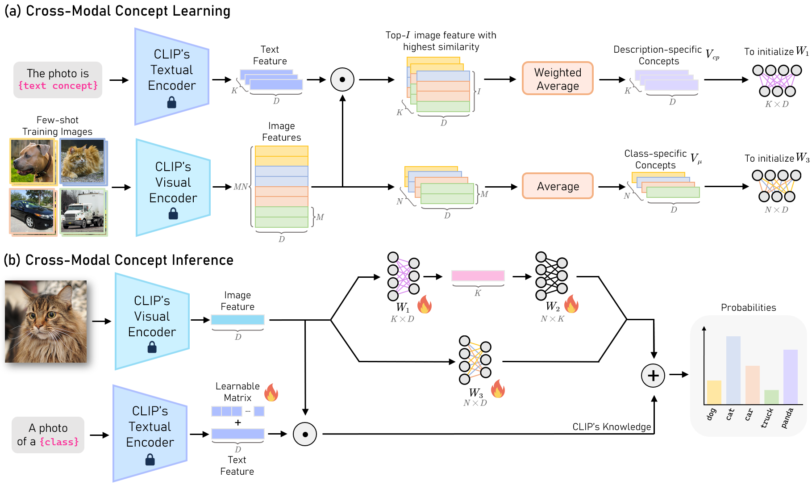
    </th>
    <th style="text-align:left" width="70%">
            Cross-Model concept learning and reference for Vision-Language Models
             
           <strong>Yi Zhang</strong> ,  Ce Zhang, Yushun Tang, Zhihai He
             
             <strong>Neurocomputing. SCI 中科院二区</strong>   
            [<a href="https://arxiv.org/pdf/2307.15460">论文</a>]
    </th>
  </tr> 
</table>

<table style="width:100%">
  <tr>
    <th width="30%">
      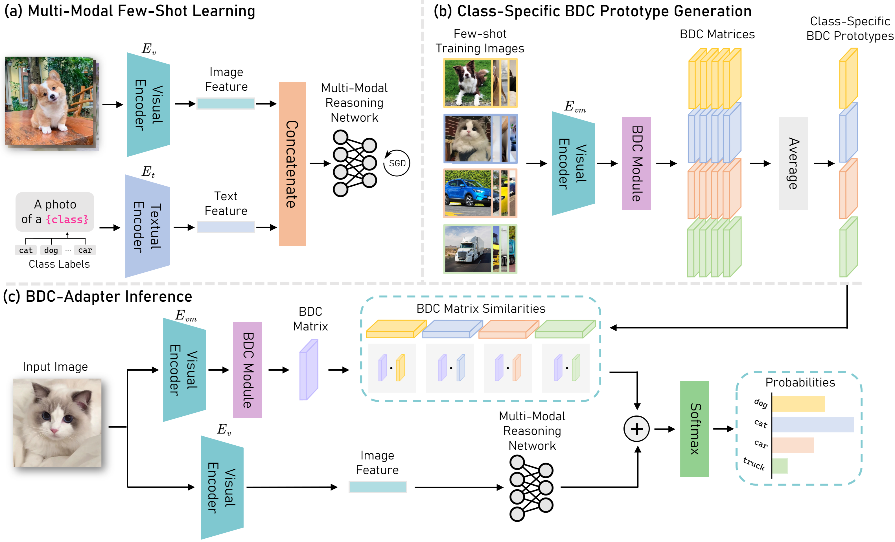
    </th>
    <th style="text-align:left" width="70%">
            BDC-Adapter: Brownian Distance Covariance for Better Vision-Language Reasoning
             
           <strong>Yi Zhang</strong> , Ce Zhang, Zihan Liao, Yushun Tang, Zhihai He
             
             British Machine Vision Conference <strong>(BMVC2023). CCF-C</strong>   
            [<a href="https://arxiv.org/pdf/2309.01256">论文</a>]
    </th>
  </tr> 
</table>

<table style="width:100%">
  <tr>
    <th width="30%">
      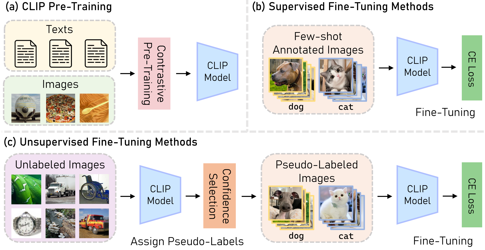
    </th>
    <th style="text-align:left" width="70%">
            Unsupervised Prototype Adapter for Vision-Language Models
             
           <strong>Yi Zhang</strong> , Ce Zhang, Xueting Hu, Zhihai He
             
              The 6th
Chinese Conference on Pattern Recognition and Computer Visione <strong>(PRCV2023). CCF-C</strong>   
            [<a href="https://arxiv.org/pdf/2308.11507">论文</a>]
    </th>
  </tr> 
</table>

专业能力
------
* 编程语言：**Python**, **Pytorch**,**C++**,**SQL**
* 专业工具：Latex, Matlab

教学
------
* 《软件工程》本科
* 《软件工程实训》本科
* 《强化学习》研究生

更多信息
------
<!--
* 中文博客[在这里](https://www.jianshu.com/u/b3c66a77e742). -->

  

